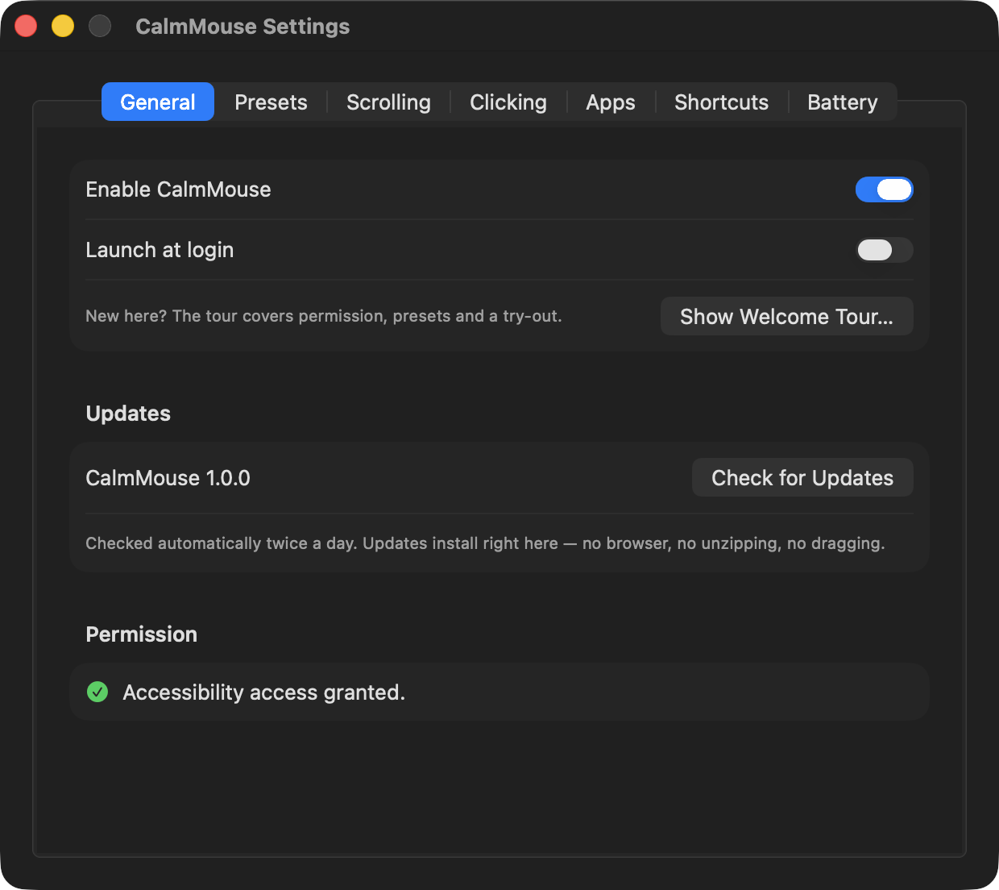

<h1 align="center">Godmouse</h1>

<p align="center">
  <b>Magic Mouse UX fixes for macOS.</b><br>
  The main one: your mouse stops scrolling the page every time you click.
</p>

<p align="center">
  <a href="https://github.com/Malik1942/Godmouse/actions/workflows/ci.yml"></a>
  
  
  <a href="LICENSE"></a>
</p>

<p align="center">
  
</p>

## The problem

The Magic Mouse's entire top shell is a touch surface, and it stays live while you click. So every
click is also a tiny swipe: you press down, your finger rolls half a millimetre, and the page jumps.
Drag a window and the document scrolls out from under it. Click a link and the link moves first.

macOS has no setting for this. [BetterTouchTool](https://folivora.ai) has one — the undocumented
`BTTBlockMagicMouseScrollWhenClicked` — but that's a paid, do-everything app for one checkbox.

Godmouse is that checkbox, plus the rest of the Magic Mouse's rough edges, in a small menu-bar app.

## Features

| | What it does |
|---|---|
| **Block scroll while clicked** | Swallows Magic Mouse scrolling while any of its buttons is held. A gesture that starts under a click stays swallowed until you lift your finger, so nothing leaks out on release. Keeps blocking for an adjustable grace period (default 200 ms) to eat the trailing scroll your finger makes as it comes off the shell. |
| **Dead zone** | Requires a gesture to travel a minimum distance before it counts. Kills the micro-jitter from a finger just *resting* on the shell. |
| **Axis lock** | Once a scroll commits to vertical or horizontal, the other axis is zeroed for the rest of the gesture and its momentum. No more diagonal drift. |
| **Momentum toggle** | Turn off the coasting tail after a flick — for the Magic Mouse only. macOS's own setting is system-wide. |
| **Per-app rules** | Any of the above, overridden per application. Disable Magic Mouse scrolling entirely in Figma, block horizontal scroll in Excel, drop momentum in a code editor. Rules follow the frontmost app. |
| **Modifier actions** | Map ⌘/⌥/⌃/⇧ + scroll to horizontal scrolling, inverted scrolling, zoom (⌘-scroll or system ⌃-scroll), or nothing at all. |
| **Tap to click** | A light single-finger tap left-clicks — no need to press the mouse down. Adjustable Firm↔Light sensitivity; taps are auto-rejected while (and shortly after) scrolling, during and right after physical clicks, for multi-finger touches, resting fingers, and grazes. Double- and triple-taps become real double-/triple-clicks. Off by default. |
| **Tap zone** | Restrict taps to the front part of the surface, away from the side edges, so the fingers gripping the mouse can't click. Adjustable depth. |
| **Tap and drag** | Tap, then touch again and hold: the button presses down **when you start moving the mouse** and releases when the finger lifts. Because the press is deferred until you actually move, a finger that just comes back to rest — or swipes to scroll — never presses anything. A quick second tap is still a double-click, so double-click-drag (selecting a word, then extending it) works. |
| **Two-finger drag (long press)** | Rest two fingers on the surface together and hold; after a moment the button presses down. Move to drag, lift either finger to drop. Fingers that land one after the other are grip, not gesture, and never trigger it. |
| **Battery warning** | A notification when the Magic Mouse drops below a threshold you set, so it doesn't die mid-afternoon. |

Everything applies **only to the Magic Mouse**. Godmouse identifies the physical device behind each
event, so your trackpad, your other mouse, and anything synthetic are passed through untouched.

Clicks that land in the middle of a scroll are handled gracefully: the app that was scrolling gets a
clean zero-delta `ended` event instead of a gesture that never finishes, and the momentum tail is
dropped so the page doesn't keep coasting under your click.

## Install

### Download

Grab the latest `Godmouse.zip` from [Releases](https://github.com/Malik1942/Godmouse/releases),
unzip it, and drag **Godmouse.app** to `/Applications`.

The release build is unsigned (no paid Apple Developer Program membership behind this project), so
the first launch needs one extra step:

```bash
xattr -dr com.apple.quarantine /Applications/Godmouse.app
open /Applications/Godmouse.app
```

Or right-click the app → **Open** → **Open** in the dialog.

### Build from source

Needs Xcode 15+ (or the Command Line Tools).

```bash
git clone https://github.com/Malik1942/Godmouse.git
cd Godmouse
./install.sh          # builds, installs to /Applications, launches, prints status
```

Building from source is the better option if you have any code-signing identity — even the free
"Apple Development" one that comes with an Apple ID. `build.sh` picks it up automatically, and a
real identity means macOS keeps your Accessibility grant across rebuilds (see below).

## Accessibility permission

Godmouse reads mouse events through a `CGEventTap`, which macOS gates behind Accessibility access:

**System Settings → Privacy & Security → Accessibility → enable Godmouse.**

The app polls for the grant and starts working within two seconds — no relaunch needed.

> **If the toggle is already ON but Godmouse still says it has no permission**, the stored grant has
> gone stale. macOS ties the grant to the app's code signature, so a rebuild or a new unsigned
> release looks like a different app while the switch still reads ON.
>
> Settings → General → **Reset grant…** fixes it (it clears the entry and re-asks). By hand:
> ```bash
> tccutil reset Accessibility com.godmouse.app
> ```

Godmouse never sees keystrokes, never touches the network, and stores nothing but its own settings.

## Menu bar vs. settings window

The switches you flip often live in the **menu bar**; everything else lives in the **settings
window** (⌘, from the menu).

**Menu bar** — status and battery line, Enable Godmouse, Block scroll while clicked, Momentum,
Axis lock, Per-app rules, Settings…, Quit.

**Settings window** — five tabs:

- **General** — enable, launch at login, permission status, troubleshooting toggles
- **Scrolling** — release grace, dead zone, axis-lock sensitivity, horizontal scroll, momentum
- **Apps** — per-app rules
- **Modifiers** — modifier + scroll actions
- **Battery** — current level and the low-battery threshold

The menu-bar icon carries state: orange when it needs attention, dimmed when paused, yellow when the
mouse battery is low.

## Scripting

Every setting is plain `UserDefaults` under `com.godmouse.app`:

```bash
defaults write com.godmouse.app blockScrollWhileClicked -bool YES
defaults write com.godmouse.app releaseGraceMs -int 200      # 0–800
defaults write com.godmouse.app deadZone -float 3            # points; 0 = off
defaults write com.godmouse.app axisLock -bool YES
defaults write com.godmouse.app momentumEnabled -bool NO
defaults write com.godmouse.app blockHorizontalScroll -bool YES
defaults write com.godmouse.app batteryWarningThreshold -int 15
defaults write com.godmouse.app tapToClick -bool YES
defaults write com.godmouse.app tapSensitivity -float 0.5   # 0 = firm ... 1 = light
defaults write com.godmouse.app tapAndDrag -bool YES
defaults write com.godmouse.app twoFingerDrag -bool YES
defaults write com.godmouse.app tapZoneEnabled -bool YES
defaults write com.godmouse.app tapZoneDepth -float 0.5     # front 25%...75% of the surface
```

The app picks changes up live. There's also a small CLI inside the bundle:

```bash
Godmouse --status      # JSON: permission, tap state, events swallowed, active app, battery
Godmouse --battery     # Magic Mouse battery level
Godmouse --resolve <id># resolve an IORegistry entry ID to a device (device-ID debugging)
```

## How it works

```
Sources/GodmouseCore/     pure logic, no AppKit — the part that's unit-tested
  ScrollBlocker.swift     the state machine: gesture phases, blocking, dead zone, axis lock
  Config.swift            settings model, per-app rule resolution, modifier actions
Sources/Godmouse/
  EventTap.swift          CGEventTap ⇄ ScrollBlocker: pass / drop / rewrite each event
  DeviceIdentifier.swift  which physical device sent this event?
  TapRecognizer.swift (Core) taps and drags: duration/movement/size gates, zone, scroll & click vetoes
  Multitouch.swift        dlopen bridge to the private MultitouchSupport framework (raw touches)
  TapController.swift     contact frames → TapRecognizer → synthetic clicks and drag press/release
  BatteryMonitor.swift    IORegistry battery polling + notification
  SettingsWindow.swift    SwiftUI settings window
  AppDelegate.swift       menu bar, permission polling, launch at login
```

Two details do most of the work:

**Device attribution.** A `CGEvent` doesn't say which mouse produced it — unless you read the
undocumented sender-ID field (`CGEventField(87)`), which holds an IORegistry entry ID. Godmouse walks
that entry's parents until it finds the HID device and reads its product name, with a cache so the
lookup happens once per device. That's how a Magic Mouse scroll is told apart from a trackpad swipe.
(The technique comes from [Mac Mouse Fix](https://github.com/noah-nuebling/mac-mouse-fix)'s
`EventUtility.m`.)

**Deferred drag presses.** Tap-and-drag arms on the follow-up touch but posts nothing until the
cursor actually moves. Pressing immediately (the obvious implementation) makes every accidental
arm a real mouse-down in whatever app is in front — in a canvas app like Figma that grabs objects
you never meant to touch. Deferring means an arm that turns out to be a resting finger or a scroll
swipe is discarded with no observable side effect at all. While a drag is held, cursor motion
continuously re-anchors the touch's drift baseline: a planted finger slides across the shell as you
push the mouse, and without re-anchoring that drift eventually looks like a scroll swipe and drops
whatever you were dragging mid-gesture.

**Gesture bookkeeping.** Continuous scrolls arrive as a phase sequence
(`mayBegin → began → changed… → ended`, then a separate momentum sequence). You can't just drop the
events you don't like: an app left mid-gesture keeps waiting for an ending, and a dropped `began`
makes the momentum tail arrive out of nowhere. The state machine tracks what each app has been
allowed to see and always closes the gesture it opened.

```bash
swift test    # 99 tests, no device or permission needed
```

## Troubleshooting

| Symptom | Fix |
|---|---|
| Menu bar says "Accessibility permission needed" but the toggle is ON | Stale grant — Settings → General → **Reset grant…** |
| Nothing is blocked, `--status` shows `lastSeenDevice: null` | Device identification isn't matching your mouse. Settings → General → **Treat unidentified touch scrolls as Magic Mouse**. Please [open an issue](https://github.com/Malik1942/Godmouse/issues) with the output of `Godmouse --status` — that's a bug worth fixing properly. |
| Trackpad scrolling got caught too | Turn *off* "Treat unidentified touch scrolls as Magic Mouse". |
| Scrolling feels like it stops too long after a click | Settings → Scrolling → lower the release grace. |
| A tap does nothing in one part of the surface | The tap zone is on. `Godmouse --status` reports `outsideZone` in `tapRejections` plus the exact landing point in `tapLastRejectionAt` — widen the depth in Settings → Clicking, or turn the zone off. |
| Want to see what's happening | Settings → General → Debug logging, then `log stream --predicate 'subsystem == "com.godmouse.app"' --level debug` |

## Prior art

Nothing on GitHub blocked Magic Mouse scroll-while-clicking on macOS when this was written
(August 2026) — hence this project. Related, and worth your time:

- **[mac-mouse-fix](https://github.com/noah-nuebling/mac-mouse-fix)** — excellent, but explicitly no Magic Mouse support. Godmouse borrows its sender-ID technique.
- **[mousetoucher](https://github.com/meatpaste/mousetoucher)** / **[magictap](https://github.com/sysmesh/magictap)** / **[MagicMouseClick](https://github.com/FAZIO11/MagicMouseClick)** — standalone tap-to-click apps for the Magic Mouse; Godmouse's MultitouchSupport bridge follows the same private-framework technique.
- **[MiddleClick](https://github.com/artginzburg/MiddleClick)** / **[fastmiddle](https://github.com/NicoNex/fastmiddle)** — three-finger middle click.
- **[MagicPrefs](https://github.com/valexa/MagicPrefsArchive)** — the 10.6-era app that could shrink the scroll area. Long dead, archived source only.

Godmouse doesn't do middle-click; MiddleClick already does it well. (Tap-to-click grew into
Godmouse anyway — having the scroll-state machine in the same process means taps can be vetoed by
real scrolling and physical clicks, which standalone tap apps can't see.)

## Roadmap

Ideas, not promises:

- Scroll speed / acceleration curve for the Magic Mouse alone
- Per-app rules driven by window title as well as bundle ID
- A proper notarized release, if the project turns out to have users
- Localisation

## Contributing

Solo project, but issues and PRs are welcome — especially bug reports with `Godmouse --status`
output and a note about which Magic Mouse generation you have.

## License

MIT — see [LICENSE](LICENSE).
