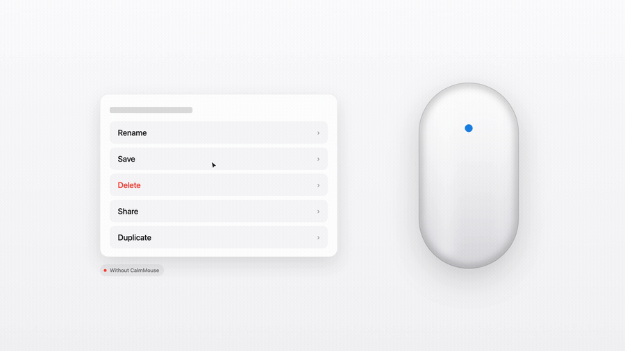
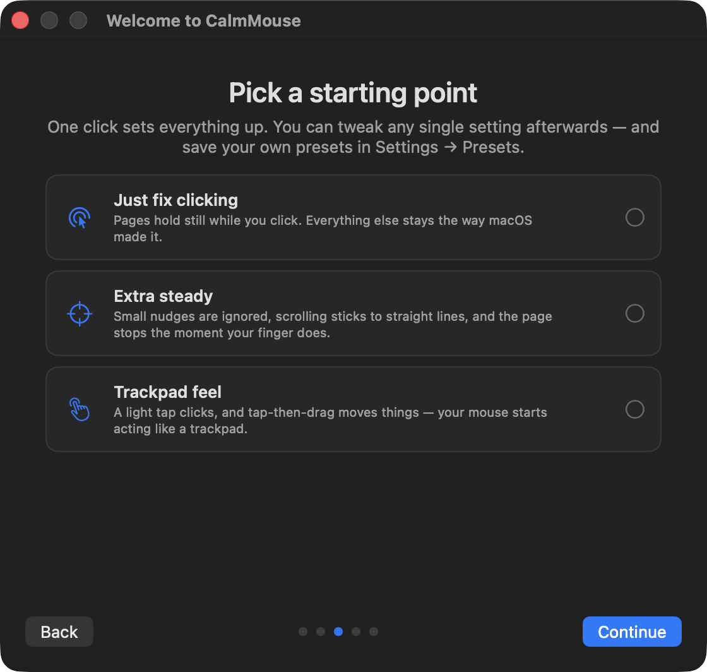
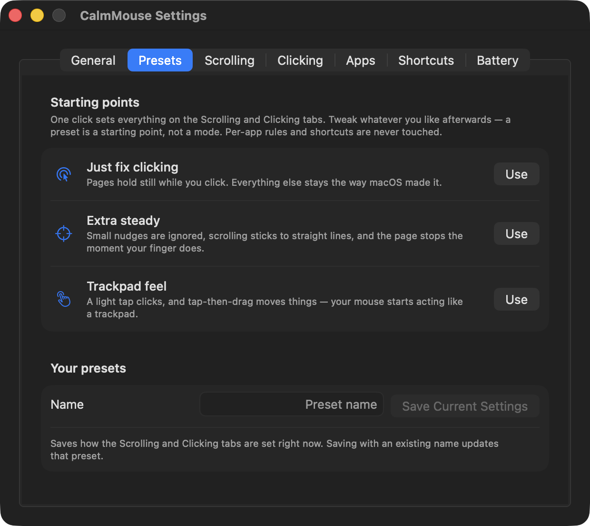

<p align="center">
  
</p>

<h1 align="center">CalmMouse</h1>

<p align="center">
  <b>Your Magic Mouse stops scrolling the page when you click.</b><br>
  Free, open source, macOS 13+.
</p>

<p align="center">
  <a href="https://github.com/Malik1942/CalmMouse/actions/workflows/ci.yml"></a>
  
  <a href="LICENSE"></a>
</p>

<p align="center">
  
</p>

<p align="center">
  <a href="https://calmmouse.malikzhang.com">Website</a> ·
  <a href="https://github.com/Malik1942/CalmMouse/releases/latest">Download</a> ·
  <a href="#install">Homebrew</a>
</p>

## Why

The whole top of a Magic Mouse is a touch surface, and it stays live while you click. So every click
is also a tiny swipe — the page moves *before* the click lands.

In a browser that's an annoyance. In Figma, Sketch or Illustrator the canvas pans as you grab a layer;
in Rhino, Blender or Fusion 360 a click zooms the viewport; in a spreadsheet the wrong cell gets
selected. macOS has no setting for it.

CalmMouse is that setting — and per-app rules go further where it hurts most, like turning off
Magic Mouse scrolling entirely in Figma.

## Install

```bash
brew install --cask malik1942/calmmouse/calmmouse
```

Or [download CalmMouse.zip](https://github.com/Malik1942/CalmMouse/releases/latest) and drag it to
Applications. Signed and notarized — it opens like any other app.

Then allow it once: **System Settings → Privacy & Security → Accessibility → CalmMouse**.
It starts working within two seconds, no relaunch.

<p align="center">
  
  <br><sub>First launch: pick a preset, then try the fix live — it counts the accidental scrolls it just caught.</sub>
</p>

## What it fixes

Everything here is **Magic Mouse only**. Your trackpad and any other mouse are untouched.

**Scrolling**

- **No scroll while clicking** — the fix. Clicks, drags and long presses hold the page still.
- **Straight lines** — a scroll commits to one axis. No diagonal drift.
- **Nudge filter** — a finger resting on the shell doesn't count as a scroll.
- **Momentum off** — drop the coasting tail, for the Magic Mouse alone.

**Clicking**

- **Tap to click** — a light tap clicks, no press needed. Tap the right side to right-click.
- **Tap and drag · two-finger drag** — drag without holding the button down.

**And**

- **Per-app rules** — no scrolling in Figma, no sideways scroll in Excel, no momentum in your editor.
- **Modifier + scroll** — hold ⌘ ⌥ ⌃ or ⇧ to scroll sideways, invert, or zoom.
- **Presets** to start from, a **low-battery warning**, **in-app updates**, and English / 简体中文 / 繁體中文.

<p align="center">
  
</p>

The switches you flip often are in the menu bar; everything else is in Settings (⌘,).
Hover any setting for a short animated preview of what it does.

<details>
<summary><b>Full feature reference</b></summary>

| | What it does |
|---|---|
| **Block scroll while clicked** | Swallows Magic Mouse scrolling while any of its buttons is held. A gesture that starts under a click stays swallowed until you lift your finger, so nothing leaks out on release. Keeps blocking for an adjustable grace period (default 200 ms) to eat the trailing scroll your finger makes as it comes off the shell. |
| **Dead zone** | Requires a gesture to travel a minimum distance before it counts. Kills the micro-jitter from a finger just *resting* on the shell. |
| **Axis lock** | Once a scroll commits to vertical or horizontal, the other axis is zeroed for the rest of the gesture and its momentum. No more diagonal drift. |
| **Momentum toggle** | Turn off the coasting tail after a flick — for the Magic Mouse only. macOS's own setting is system-wide. |
| **Per-app rules** | Any of the above, overridden per application. Disable Magic Mouse scrolling entirely in Figma, block horizontal scroll in Excel, drop momentum in a code editor. Rules follow the frontmost app. |
| **Modifier actions** | Map ⌘/⌥/⌃/⇧ + scroll to horizontal scrolling, inverted scrolling, zoom (⌘-scroll or system ⌃-scroll), or nothing at all. |
| **Tap to click** | A light single-finger tap left-clicks — no need to press the mouse down. Adjustable Firm↔Light sensitivity; taps are auto-rejected while (and shortly after) scrolling, during and right after physical clicks, for multi-finger touches, resting fingers, and grazes. Double- and triple-taps become real double-/triple-clicks. Off by default. |
| **Tap to right-click** | Give tapping the right button too, in one of two ways: **a tap on the right side** of the surface right-clicks — the same side a physical right click uses (the default) — or **a double-tap**, where a second quick tap in the same spot opens the right-click menu (in that mode, double-click by pressing or by tapping twice a little slower). Right taps respect the tap zone, never start a drag, and reset the double-click chain like a real right click. Off by default. |
| **Tap zone** | Restrict taps to the front part of the surface, away from the side edges, so the fingers gripping the mouse can't click. Adjustable depth. |
| **Tap and drag** | Tap, then touch again and hold: the button presses down **when you start moving the mouse** and releases when the finger lifts. Because the press is deferred until you actually move, a finger that just comes back to rest — or swipes to scroll — never presses anything. A quick second tap is still a double-click, so double-click-drag (selecting a word, then extending it) works. |
| **Two-finger drag (long press)** | Rest two fingers on the surface together and hold; after a moment the button presses down. Move to drag, lift either finger to drop. Fingers that land one after the other are grip, not gesture, and never trigger it. |
| **Battery warning** | A notification when the Magic Mouse drops below a threshold you set, so it doesn't die mid-afternoon. |
| **Presets** | Three one-click starting points — *Just fix clicking*, *Extra steady*, *Trackpad feel* — that set the Scrolling and Clicking options in one go. Everything stays tweakable afterwards, and you can save your own setups as named presets. Per-app rules and shortcuts are never touched. |
| **In-app updates** | CalmMouse checks the releases feed twice a day; a new version shows up as a menu-bar item and in Settings → General with its release notes. One click downloads, verifies the signature is ours, swaps the app in place, and relaunches. |
| **Speaks your language** | English, 简体中文 and 繁體中文, following the system language setting — no in-app switch needed. |

Clicks that land in the middle of a scroll are handled gracefully: the app that was scrolling gets a
clean zero-delta `ended` event instead of a gesture that never finishes, and the momentum tail is
dropped so the page doesn't keep coasting under your click.

The menu-bar icon carries state: orange when it needs attention, dimmed when paused, yellow when the
mouse battery is low.

<p align="center">
  
</p>

</details>

## Under the hood

CalmMouse never sees keystrokes, never touches the network, and stores nothing but its own settings.

<details>
<summary><b>How it works</b> — device attribution, deferred drag presses, gesture bookkeeping</summary>

```
Sources/CalmMouseCore/     pure logic, no AppKit — the part that's unit-tested
  ScrollBlocker.swift     the state machine: gesture phases, blocking, dead zone, axis lock
  Config.swift            settings model, per-app rule resolution, modifier actions
  TapRecognizer.swift     taps and drags: duration/movement/size gates, zone, scroll & click vetoes
Sources/CalmMouse/
  EventTap.swift          CGEventTap ⇄ ScrollBlocker: pass / drop / rewrite each event
  DeviceIdentifier.swift  which physical device sent this event?
  Multitouch.swift        dlopen bridge to the private MultitouchSupport framework (raw touches)
  TapController.swift     contact frames → TapRecognizer → synthetic clicks and drag press/release
  BatteryMonitor.swift    IORegistry battery polling + notification
  SettingsWindow.swift    SwiftUI settings window
  AppDelegate.swift       menu bar, permission polling, launch at login
```

**Device attribution.** A `CGEvent` doesn't say which mouse produced it — unless you read the
undocumented sender-ID field (`CGEventField(87)`), which holds an IORegistry entry ID. CalmMouse walks
that entry's parents until it finds the HID device and reads its product name, with a cache so the
lookup happens once per device. That's how a Magic Mouse scroll is told apart from a trackpad swipe.
(The technique comes from [Mac Mouse Fix](https://github.com/noah-nuebling/mac-mouse-fix)'s
`EventUtility.m`.)

**Deferred drag presses.** Tap-and-drag arms on the follow-up touch but posts nothing until the
cursor actually moves. Pressing immediately (the obvious implementation) makes every accidental
arm a real mouse-down in whatever app is in front — in a canvas app like Figma that grabs objects
you never meant to touch. Deferring means an arm that turns out to be a resting finger or a scroll
swipe is discarded with no observable side effect at all. While a drag is held, cursor motion
continuously re-anchors the touch's drift baseline: a planted finger slides across the shell as you
push the mouse, and without re-anchoring that drift eventually looks like a scroll swipe and drops
whatever you were dragging mid-gesture.

**Gesture bookkeeping.** Continuous scrolls arrive as a phase sequence
(`mayBegin → began → changed… → ended`, then a separate momentum sequence). You can't just drop the
events you don't like: an app left mid-gesture keeps waiting for an ending, and a dropped `began`
makes the momentum tail arrive out of nowhere. The state machine tracks what each app has been
allowed to see and always closes the gesture it opened.

```bash
swift test    # 99 tests, no device or permission needed
```

</details>

<details>
<summary><b>Scripting</b> — every setting is a <code>defaults</code> key, plus a <code>--status</code> CLI</summary>

Every setting is plain `UserDefaults` under `com.calmmouse.app`, picked up live:

```bash
defaults write com.calmmouse.app blockScrollWhileClicked -bool YES
defaults write com.calmmouse.app releaseGraceMs -int 200      # 0–800
defaults write com.calmmouse.app deadZone -float 3            # points; 0 = off
defaults write com.calmmouse.app axisLock -bool YES
defaults write com.calmmouse.app momentumEnabled -bool NO
defaults write com.calmmouse.app blockHorizontalScroll -bool YES
defaults write com.calmmouse.app batteryWarningThreshold -int 15
defaults write com.calmmouse.app tapToClick -bool YES
defaults write com.calmmouse.app tapSensitivity -float 0.5   # 0 = firm ... 1 = light
defaults write com.calmmouse.app tapAndDrag -bool YES
defaults write com.calmmouse.app twoFingerDrag -bool YES
defaults write com.calmmouse.app tapZoneEnabled -bool YES
defaults write com.calmmouse.app tapZoneDepth -float 0.5     # front 25%...75% of the surface
```

There's also a small CLI inside the bundle:

```bash
CalmMouse --status      # JSON: permission, tap state, events swallowed, active app, battery
CalmMouse --battery     # Magic Mouse battery level
```

</details>

<details>
<summary><b>Build from source</b></summary>

Needs Xcode 15+ (or the Command Line Tools).

```bash
git clone https://github.com/Malik1942/CalmMouse.git
cd CalmMouse
./install.sh          # builds, installs to /Applications, launches, prints status
```

Building from source is the better option if you have any code-signing identity — even the free
"Apple Development" one that comes with an Apple ID. `build.sh` picks it up automatically, and a
real identity means macOS keeps your Accessibility grant across rebuilds.

</details>

<details>
<summary><b>Troubleshooting</b></summary>

| Symptom | Fix |
|---|---|
| Menu bar says "Accessibility permission needed" but the toggle is ON | The stored grant has gone stale — macOS ties it to the app's code signature, so a rebuild or an old ad-hoc-signed build looks like a different app. Settings → General → **Reset grant…** (or `tccutil reset Accessibility com.calmmouse.app`). |
| Nothing is blocked, `--status` shows `lastSeenDevice: null` | Device identification isn't matching your mouse. Run `defaults write com.calmmouse.app treatUnknownContinuousAsMagicMouse -bool true` and relaunch. Please [open an issue](https://github.com/Malik1942/CalmMouse/issues) with the output of `CalmMouse --status` — that's a bug worth fixing properly. |
| Trackpad scrolling got caught too | `defaults write com.calmmouse.app treatUnknownContinuousAsMagicMouse -bool false`, then relaunch. |
| Scrolling feels like it stops too long after a click | Settings → Scrolling → lower the release grace. |
| A tap does nothing in one part of the surface | The tap zone is on. `CalmMouse --status` reports `outsideZone` in `tapRejections` plus the exact landing point in `tapLastRejectionAt` — widen the depth in Settings → Clicking, or turn the zone off. |
| Want to see what's happening | `defaults write com.calmmouse.app debugLogging -bool true`, relaunch, then `log stream --predicate 'subsystem == "com.calmmouse.app"' --level debug` |

</details>

<details>
<summary><b>Prior art</b></summary>

Nothing on GitHub blocked Magic Mouse scroll-while-clicking on macOS when this was written
(August 2026) — hence this project. Related, and worth your time:

- **[mac-mouse-fix](https://github.com/noah-nuebling/mac-mouse-fix)** — excellent, but explicitly no Magic Mouse support. CalmMouse borrows its sender-ID technique.
- **[mousetoucher](https://github.com/meatpaste/mousetoucher)** / **[magictap](https://github.com/sysmesh/magictap)** / **[MagicMouseClick](https://github.com/FAZIO11/MagicMouseClick)** — standalone tap-to-click apps for the Magic Mouse; CalmMouse's MultitouchSupport bridge follows the same private-framework technique.
- **[MiddleClick](https://github.com/artginzburg/MiddleClick)** / **[fastmiddle](https://github.com/NicoNex/fastmiddle)** — three-finger middle click.
- **[MagicPrefs](https://github.com/valexa/MagicPrefsArchive)** — the 10.6-era app that could shrink the scroll area. Long dead, archived source only.

CalmMouse doesn't do middle-click; MiddleClick already does it well. (Tap-to-click grew into
CalmMouse anyway — having the scroll-state machine in the same process means taps can be vetoed by
real scrolling and physical clicks, which standalone tap apps can't see.)

</details>

## Contributing

Solo project; issues and PRs are welcome. The most useful bug report is `CalmMouse --status` output
plus which Magic Mouse generation you have. On the table, not promised: a scroll-acceleration curve
for the Magic Mouse alone, and per-app rules keyed on window title.

## License

MIT — see [LICENSE](LICENSE).
